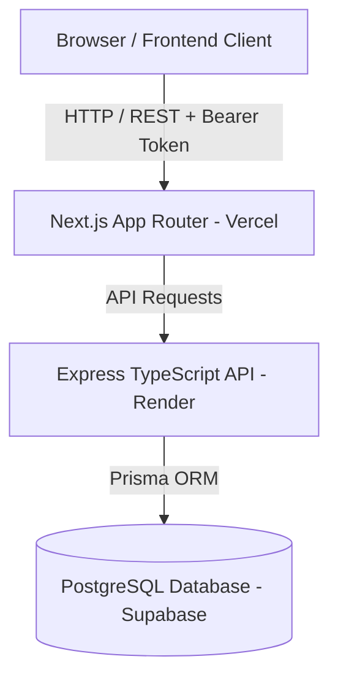

# BloodBridge

BloodBridge is a district-level blood donor matching platform designed to connect hospitals urgently needing blood with verified, compatible, and nearby donors. In emergency medical situations, hospitals may need specific blood groups while eligible donors are available nearby in the district, but locating and contacting them quickly remains a challenge. BloodBridge solves this by matching blood requests against donor compatibility, eligibility, availability, and geographic proximity using a priority-based ranking pipeline. This project is a working prototype built for hackathon demonstration.

---

## What It Does

- **Blood Donor Registration**: Donors can register with their blood group, location coordinates, and contact details.
- **Hospital Registration**: Hospitals can set up profiles with district details and emergency contact information.
- **Donor Profile & Availability Management**: Donors can toggle their status between `AVAILABLE`, `UNAVAILABLE`, or `PAUSED`.
- **Hospital Blood Request Creation**: Hospitals can issue urgent blood requests with required blood groups, units, and deadlines.
- **Blood-Group Compatibility Checking**: Automatically filters donors based on strict ABO and Rh red-cell compatibility rules.
- **Donor Eligibility & Availability Filtering**: Excludes donors who are marked unavailable or unverified.
- **Geographic Distance Calculation**: Computes real-time Haversine distance between hospital and candidate donors.
- **Priority-Based Donor Ranking**: Ranks eligible donors by proximity and operational priority score.
- **Matching Workflow**: Generates ranked match records allowing hospitals to request help and donors to accept or reject.
- **Authentication**: Secure JWT token-based authorization for protected hospital and donor API endpoints.
- **Backend API**: RESTful Express API handling user sync, donor profiles, hospital requests, and matching execution.
- **PostgreSQL Database**: Relational database schema with spatial indexing for fast donor queries.
- **Separate Frontend & Backend Deployment**: Decoupled architecture deployed independently on Vercel and Render.

---

## How the Matching Works

The BloodBridge matching engine processes incoming hospital requests through a 7-step pipeline:

1. **Request Creation**: Hospital submits a blood request with required blood group, units, and urgency.
2. **Compatibility Filtering**: System filters donors using medical ABO/Rh compatibility matrices (e.g., A+ accepts A+, A-, O+, O-).
3. **Eligibility Verification**: Donors with unverified status or medical flags are filtered out.
4. **Availability Filtering**: System removes donors currently marked as `UNAVAILABLE` or `PAUSED`.
5. **Distance Calculation**: Haversine formula calculates straight-line distance (in km) between hospital and donor coordinates.
6. **Priority Ranking**: Remaining candidate donors are scored and ranked based on geographic proximity and response history.
7. **Match Generation**: System returns the top ranked matches and notifies suitable donors.

---

## Tech Stack

| Layer | Technology |
| --- | --- |
| **Frontend** | Next.js (App Router), React 18, TypeScript, Tailwind CSS, Lucide Icons |
| **Backend** | Node.js, Express.js, TypeScript |
| **Database** | PostgreSQL (Supabase Hosted) |
| **ORM** | Prisma ORM 5.x |
| **Validation & Testing** | Zod schema validation, Vitest, Supertest |
| **Deployment** | Vercel (Frontend), Render (Backend) |

---

## Architecture



---

## Project Structure

```
blood_bridge/
├── frontend/             # Next.js frontend application (App Router, UI components)
│   ├── app/              # Dashboard pages (Hospital, Donor, Login, Register)
│   ├── components/       # Shared UI components
│   ├── lib/              # API client and Authentication context
│   └── package.json
├── backend/              # Node.js Express TypeScript API
│   ├── src/
│   │   ├── config/       # Environment, Supabase & Prisma client setup
│   │   ├── controllers/  # Route handlers (Auth, Donor, Hospital, Request, Match)
│   │   ├── middleware/   # Authentication, Role check & Zod validation middleware
│   │   ├── routes/       # Express route definitions
│   │   ├── services/     # Core business logic & matching engine pipeline
│   │   └── validators/   # Zod input validation schemas
│   ├── prisma/           # PostgreSQL schema & database configuration
│   ├── tests/            # Vitest unit and integration test suite
│   └── package.json
├── docs/                 # Technical documentation (API, Architecture, DB, Matching)
├── .env.example          # Template for environment variables
├── package.json          # Root monorepo workspace configuration
└── README.md
```

---

## Running Locally

### 1. Clone the Repository
```bash
git clone https://github.com/emiltomjoseph/blood_bridge.git
cd blood_bridge
```

### 2. Install Dependencies
```bash
npm install
```

### 3. Configure Environment Variables
Copy `.env.example` to `.env` in the root directory and update credentials (do **not** commit actual secret keys to Git):
```bash
cp .env.example .env
```

### 4. Generate Prisma Client
```bash
npm run prisma:generate
```

### 5. Start Development Servers
Start both backend (port 5000) and frontend (port 3000) concurrently:
```bash
npm run dev
```

Or run them individually in separate terminals:
- **Backend**: `npm run dev:backend`
- **Frontend**: `npm run dev:frontend`

---

## Environment Variables

Copy `.env.example` to `.env` and configure the following variables with your own credentials:

```env
# Backend Server
PORT=5000
NODE_ENV=development
CORS_ORIGIN=http://localhost:3000

# PostgreSQL / Supabase Database Connections
DATABASE_URL="postgresql://<user>:<password>@<host>:5432/<db>?schema=public"
DIRECT_URL="postgresql://<user>:<password>@<host>:5432/<db>?schema=public"

# Supabase Auth Configuration
SUPABASE_URL="https://<your-project-ref>.supabase.co"
SUPABASE_SERVICE_ROLE_KEY="<your-supabase-service-role-key>"

# Frontend Configuration
NEXT_PUBLIC_API_URL="http://localhost:5000"
NEXT_PUBLIC_SUPABASE_URL="https://<your-project-ref>.supabase.co"
NEXT_PUBLIC_SUPABASE_ANON_KEY="<your-supabase-anon-key>"
```

> **Note**: Never commit actual database passwords, service role keys, or secret tokens to version control.

---

## Deployment

The working prototype is currently deployed and live at:

- **Frontend Application (Vercel)**: https://blood-bridge-sigma-nine.vercel.app
- **Backend API (Render)**: https://blood-bridge-25u5.onrender.com
- **Database**: PostgreSQL hosted on Supabase

---

## Testing & Build Verification

The codebase has been verified with zero compilation errors and full test coverage for core workflows:

- **TypeScript Type Check**: `0 errors` (`npm run check-types`)
- **Backend Test Suite**: `35 / 35 tests passed` (`npm run test --workspace=backend`)
- **Backend Build**: Successful (`npm run build --workspace=backend`)
- **Frontend Build**: Successful (`npm run build --workspace=frontend`)
- **Database Connection**: Live Supabase PostgreSQL connection verified (`GET /api/health` returns `HTTP 200 OK`)

---

## Current Limitations

- **Straight-Line Distance**: Geographic distance is calculated using the Haversine formula (as-the-crow-flies) rather than live road routing APIs.
- **Simulated Notifications**: Donor match notifications currently update database state rather than dispatching live SMS/WhatsApp messages.
- **Manual Verification Status**: Hospital and donor verification statuses default to pending until approved by an administrator.

---

## Why We Built It

In emergency healthcare, every minute spent searching for blood donors can impact patient outcomes. Existing emergency communication often relies on broadcast messaging or manual phone calls, which can be slow and disorganized. We built BloodBridge to automate district-level donor discovery by immediately filtering for blood group compatibility, donor availability, and geographic proximity. By providing hospitals with a prioritized, actionable list of suitable donors, BloodBridge reduces coordination delay during critical emergencies. Note that BloodBridge is designed to assist coordination and does not replace blood banks or medical professionals.

---

## Team

BloodBridge was built by a two-member hackathon team.

---

## Status

**Status: Working prototype**

BloodBridge has a fully functional frontend deployed on Vercel, a live Express backend API deployed on Render, and a connected PostgreSQL database hosted on Supabase.
